# Módulo de Agendamiento — Diagramas de flujo

> Documento de referencia del flujo funcional del **módulo de Agendamiento** de
> NECTO (citas con profesionales). Refleja lo implementado hoy (mock/front-end).
> El canal de WhatsApp del cliente es externo; hoy el self-service del cliente
> aún no está construido en este módulo (ver "Pendientes").

Actores:
- **Cliente / paciente** — reserva/gestiona su cita (por WhatsApp u operador).
- **Profesional** — quien atiende (psicología, nutrición, fisioterapia...). Tiene
  su propia agenda y su propia **disponibilidad** (días/horario/duración de bloque).
  Ahora también **puede ingresar** (opción A): entra como un operador ligado a sí
  mismo y ve **solo su** agenda/calendario/citas y puede crear citas (ver sección 3b).
- **Operador / asesor** — ayudante ligado a uno o varios profesionales; solo ve y
  gestiona lo de **sus** profesionales. Además atiende la **bandeja de Chats** de
  clientes que piden hablar con un asesor (sección 12).
- **Administrador** — dueño; gestiona profesionales, disponibilidad, ve todo el
  negocio y configura el programa de fidelidad.

> **Diferencia clave admin vs operador:** el admin trabaja sobre **todo el negocio**
> (todos los profesionales y todos los clientes); el operador trabaja **acotado a
> sus profesionales asignados** (`profesionalIds`) y a los clientes de esos
> profesionales.

---

## 1. Arranque y selección de rol (post-login)

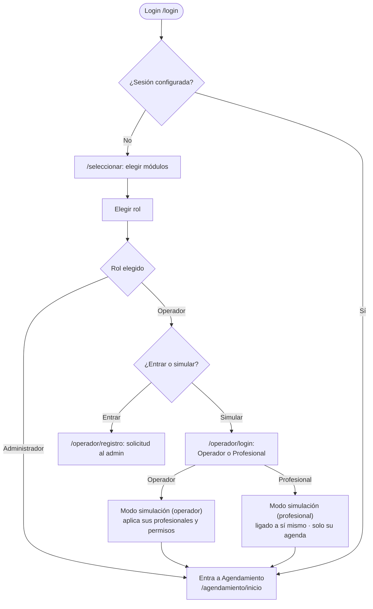

Notas:
- El módulo se elige en `/seleccionar` (Turnos y/o Agendamiento).
- La **simulación de operador** aplica sus permisos: solo ve las secciones y los
  **profesionales** que el admin le asignó (ver diagrama 6).
- Desde `/operador/login` ahora se puede entrar como **Operador** o como
  **Profesional** (opción A; ver sección 3b).

---

## 2. Vistas del módulo por rol

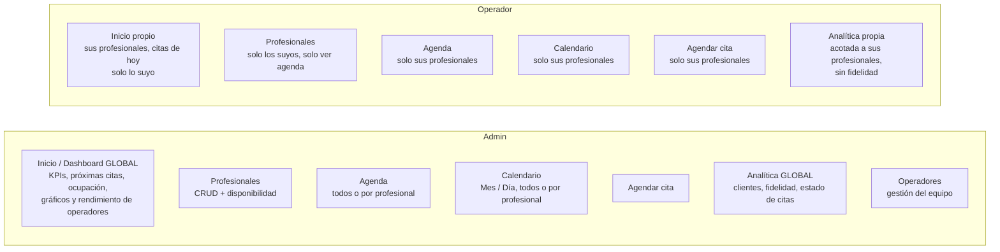

El operador **no** ve: Operadores, ni el CRUD/disponibilidad de profesionales, ni
la configuración del programa de fidelidad, ni datos de profesionales ajenos.

---

## 3. Inicio: admin (global) vs operador (personal)

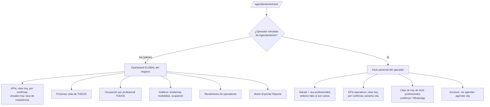

- El wrapper de la ruta decide qué vista renderizar según el rol.
- El inicio del operador es **operativo y sin analítica** (no le interesan las
  estadísticas de negocio).

---

## 3b. Acceso del profesional (opción A: operador ligado a sí mismo)

El profesional puede ingresar a NECTO para ver **su propia** agenda. Se modela
reutilizando el mecanismo de simulación: el profesional entra como un "operador
sintético" ligado únicamente a sí mismo, con permisos acotados.

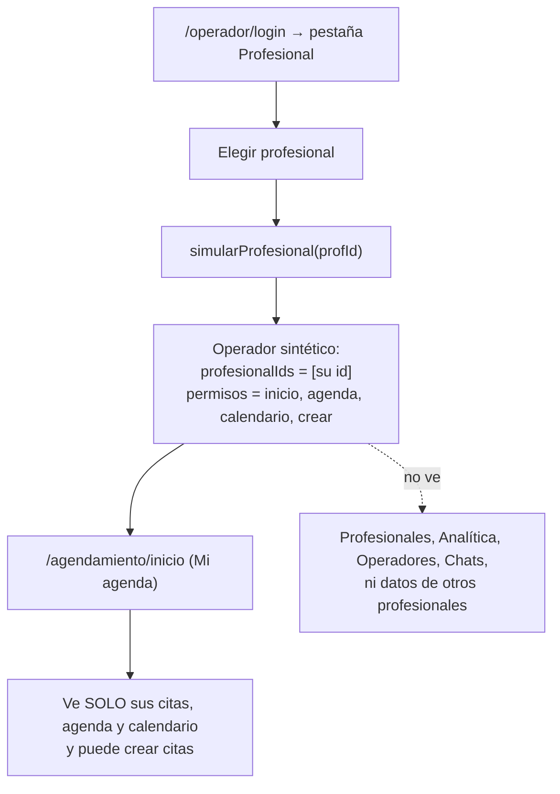

- El profesional **ve**: su Inicio ("Mi agenda"), su Agenda, su Calendario y
  Agendar cita (para sí mismo).
- El profesional **no ve**: gestión de profesionales, analítica, operadores, la
  bandeja de Chats, ni nada de otros profesionales.
- En el header, el chip de identidad muestra **"Profesional · {nombre}"** (en vez
  de "Operando como").
- Internamente reutiliza `puedeVerProfesional` / `profesionalesVisiblesIds`: para
  un profesional esa lista es simplemente `[suId]`.

---

## 4. Profesionales y disponibilidad

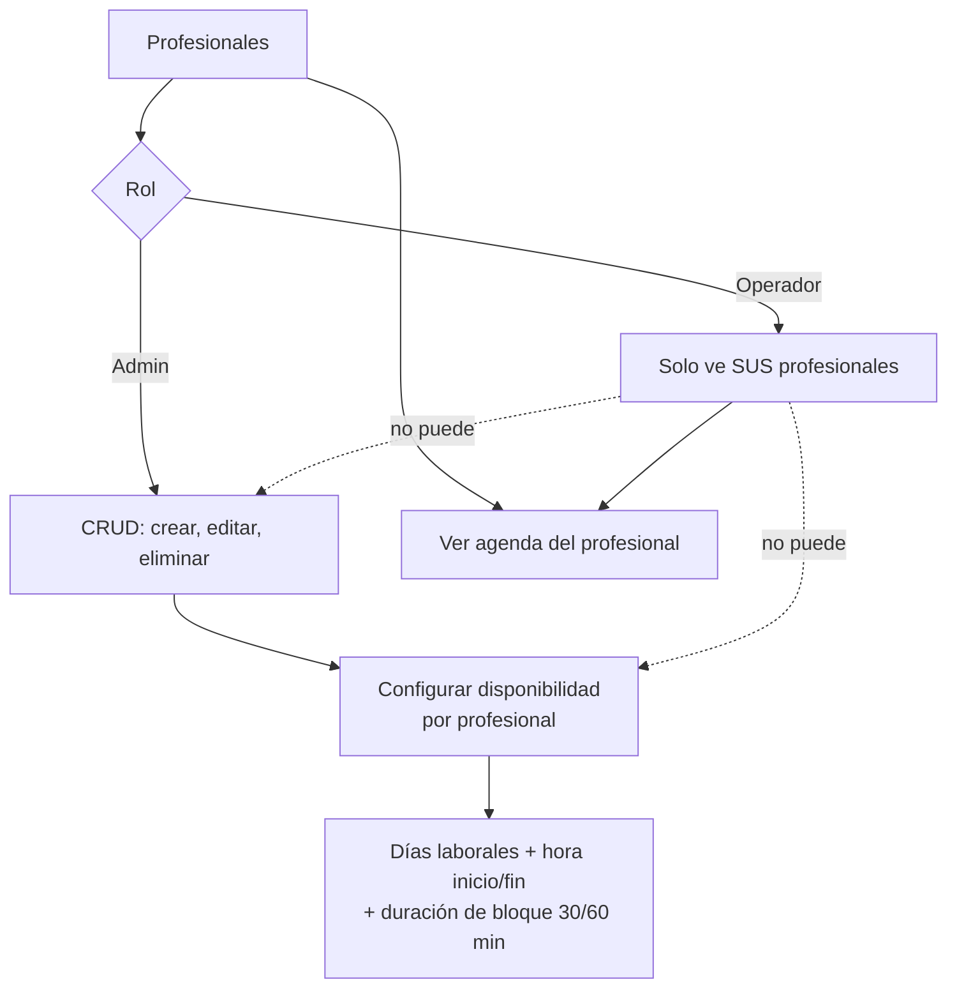

- La **disponibilidad es por profesional** (cada uno define sus días y horario).
- El **calendario** y **Agendar cita** respetan esa disponibilidad: bloquean los
  días/horas en que el profesional no atiende.
- El operador solo puede **Ver agenda**; no crea, edita, elimina ni configura.

---

## 5. Agenda y Calendario — alcance por profesional

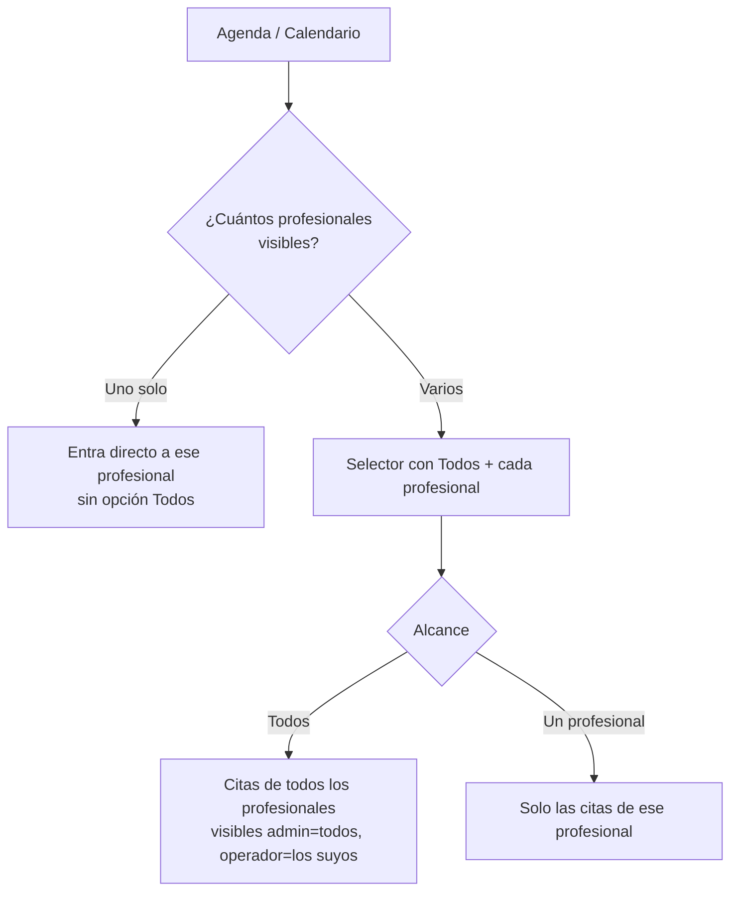

### Calendario: toggle Mes / Día

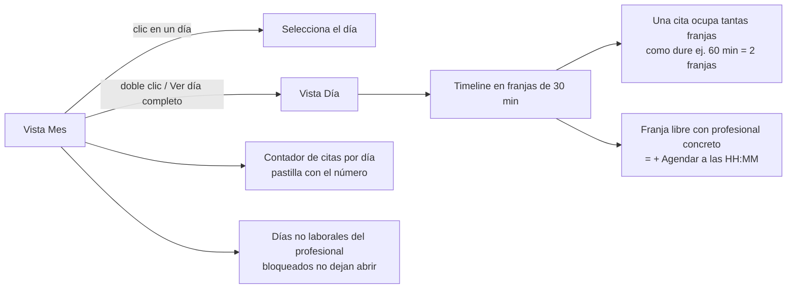

- **Mes**: cuadrícula con una **pastilla con el número** de citas por día (usa el
  color del profesional cuando hay uno concreto). Días no laborales del profesional
  quedan **bloqueados**.
- **Día**: **timeline por horas** en franjas de 30 min; una cita se dibuja como un
  card que abarca las franjas que dura.
- En modo "Todos" el operador ve solo las citas de **sus** profesionales.

---

## 6. Permisos: qué profesionales ve el operador

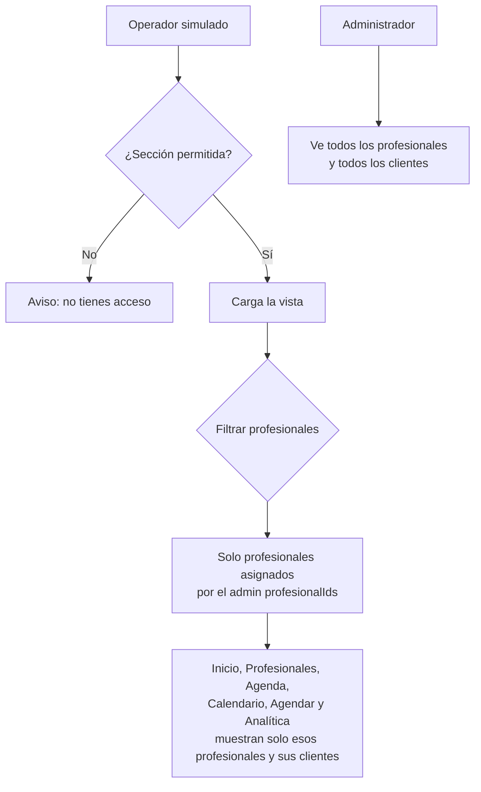

El admin define los profesionales de cada operador en **Operadores → perfil**.
El `?prof=` en la URL se valida contra los permisos: un operador no puede forzar
un profesional que no tiene asignado.

---

## 7. Ciclo de vida de una cita

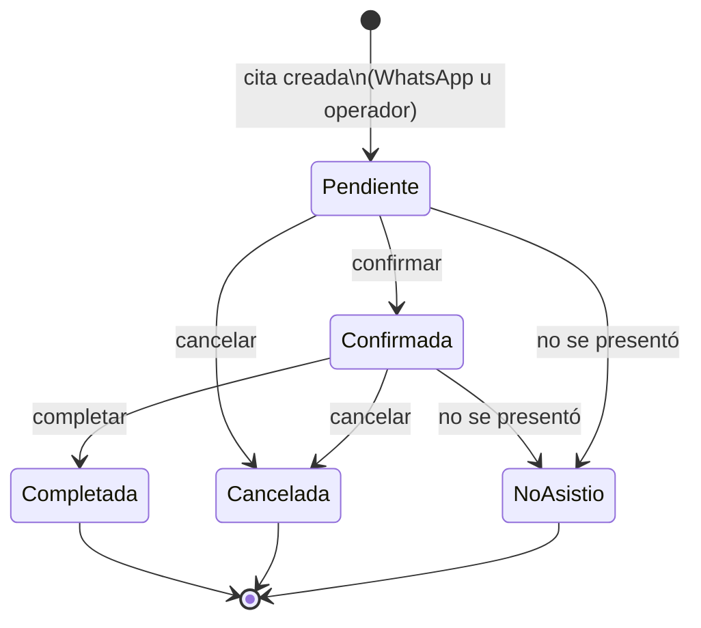

- Estados: **pendiente, confirmada, completada, cancelada, no asistió (noshow)**.
- Cada cita tiene una **modalidad** (presencial / virtual) y un **origen**
  (whatsapp / operador).

---

## 8. Crear cita (Agendar)

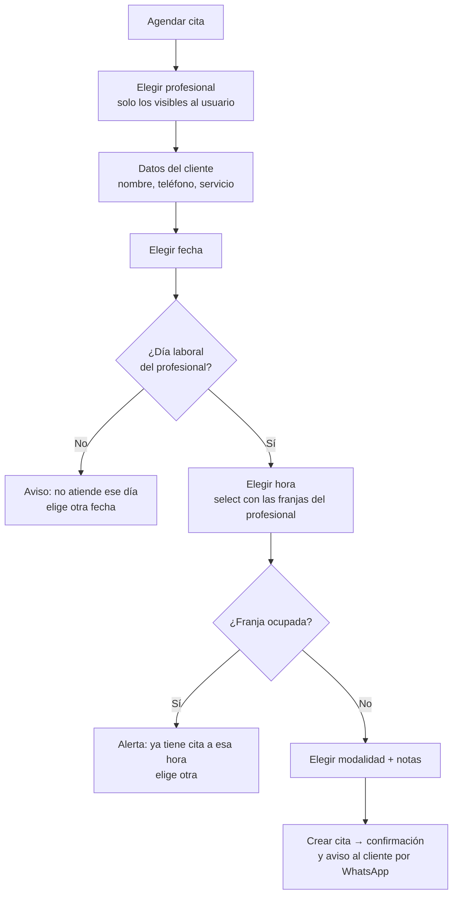

- El selector de profesional solo ofrece los **visibles** para el usuario.
- Las horas se limitan a las **franjas del profesional** según su disponibilidad;
  las ocupadas se marcan y **avisan** si se eligen.

---

## 9. Analítica: admin (global) vs operador (acotada)

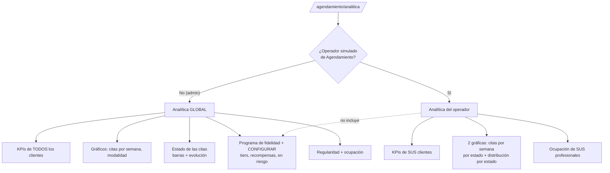

- La analítica del operador está **acotada** a sus profesionales y a los clientes
  de esos profesionales.
- El **programa de fidelidad** (y su configuración) es **exclusivo del admin**; el
  operador no lo ve.

---

## 10. Programa de fidelidad (solo admin)

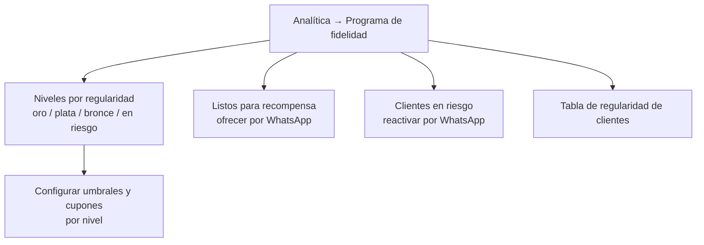

- El nivel de cada cliente se deriva de su **regularidad** (citas completadas,
  inasistencias, tiempo sin volver), con umbrales configurables por el admin.

---

## 11. Mapa de rutas del módulo Agendamiento

| Ruta | Vista | Rol | Notas |
|------|-------|-----|-------|
| `/agendamiento/inicio` | Inicio | Admin / Operador | Admin: dashboard global. Operador: inicio personal. |
| `/agendamiento` | Agenda | Admin / Operador | Todos o por profesional; operador solo los suyos. |
| `/agendamiento/profesionales` | Profesionales | Admin / Operador | Admin: CRUD + disponibilidad. Operador: solo ver agenda de los suyos. |
| `/agendamiento/calendario` | Calendario | Admin / Operador | Toggle Mes/Día; operador solo sus profesionales. |
| `/agendamiento/crear` | Agendar cita | Admin / Operador | Operador solo para sus profesionales; respeta disponibilidad. |
| `/agendamiento/detalles` | Detalle de cita | Admin / Operador | Detalle de una cita (`?id=`). |
| `/agendamiento/chats` | Chats (bandeja de asesor) | Admin / Operador | Conversaciones de clientes que piden asesor; el operador las toma y responde. Sección `chats`. |
| `/agendamiento/analitica` | Analítica | Admin / Operador | Admin: global + fidelidad. Operador: acotada, sin fidelidad. |
| `/agendamiento/operadores` | Operadores | Solo admin | Gestión del equipo y asignación de profesionales. |
| `/operador/login` | Simular acceso | Demo | Entrar como Operador o como Profesional (opción A). |
| `/wa` | Simulador WhatsApp | Demo | Selector Turnos/Agendamiento; 4 chats guionizados por módulo. |

---

## 12. Canal del cliente por WhatsApp (simulado)

El canal de WhatsApp del cliente se **simula** en `/wa` (solo lectura). El
simulador tiene un selector **Turnos / Agendamiento**; para Agendamiento hay 4
conversaciones guionadas cliente ↔ bot.

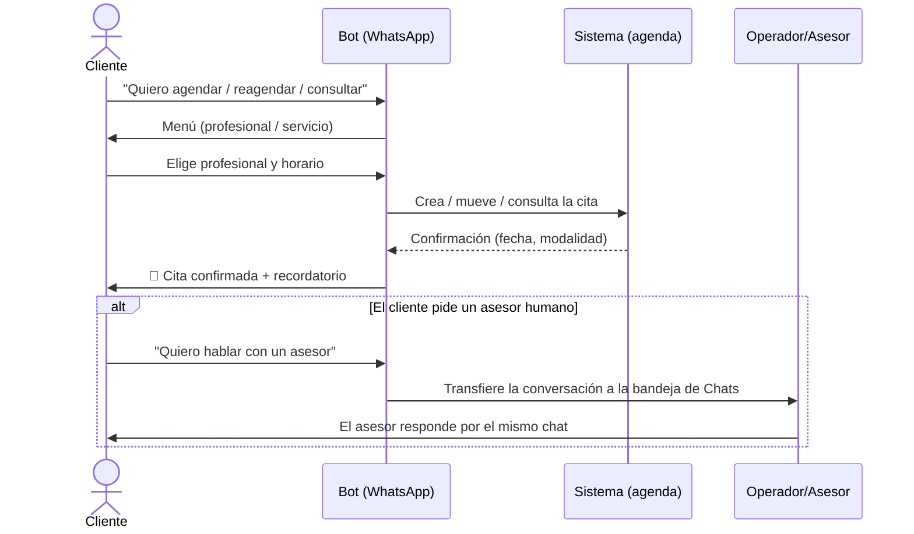

Los 4 escenarios de Agendamiento en `/wa`:

| # | Contacto | Escenario |
|---|----------|-----------|
| 1 | Carlos Mendoza | Agenda una cita self-service (Psicología, virtual) |
| 2 | Laura Torres | Reagenda su cita de nutrición |
| 3 | Sofía Díaz | Consulta sus próximas citas |
| 4 | Marta Ruiz | Pide hablar con un asesor → alimenta la bandeja de Chats |

---

## 13. Bandeja de Chats de asesor

Cuando un cliente pide "hablar con un asesor" (chat 4), su conversación entra a
la **bandeja de Chats** (`/agendamiento/chats`). Un operador la toma, responde y
la marca como resuelta. Vista construida con el flujo Elements (ChatBox /
ChatSidebar / Tabs).

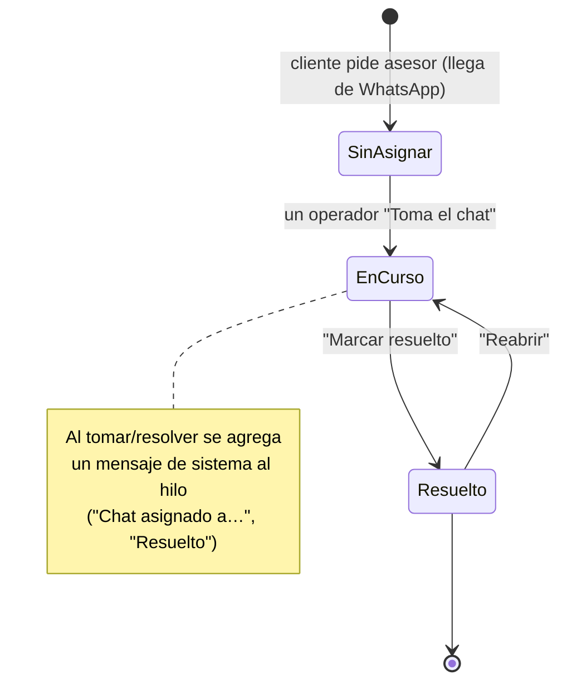

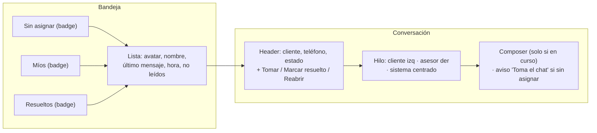

- Filtros por estado con contador: **Sin asignar**, **Míos**, **Resueltos**.
- **Tomar chat**: pasa a *en curso*, se asigna al asesor y se añade un mensaje de
  sistema; solo entonces se habilita el editor de respuesta.
- **Marcar resuelto** / **Reabrir**: cambian el estado y dejan traza en el hilo.
- El **profesional no ve** esta bandeja (no está en sus permisos); sí el operador
  (con permiso `chats`) y el admin.
- Estado persistido en `localStorage` (`necto.asesorChats`); el modo "desde 0" la
  vacía de forma reversible.

---

## Pendientes (fuera del alcance actual, ya conocidos)

- Integración real del bot de WhatsApp y de la bandeja de Chats (hoy simulados:
  `/wa` guionizado y la bandeja alimentada por seed + acciones locales).
- Login real del profesional (hoy se entra vía "Simular acceso → Profesional";
  cuando exista auth, el `profesionalId` se derivaría de su cuenta).
- Compartir el formulario de agendar con el cliente (vista pública + apartado de
  compartir en Crear cita) — en discusión.
- Backend real (hoy todo es mock + estado en memoria/localStorage).
- Datos del negocio (nombre, logo, giro) y catálogo de servicios por profesional.
- Configuración inicial (onboarding) del módulo de Agendamiento, equivalente al
  de Turnos.
