# Módulo de Turnos — Flujo funcional y diagramas

> Documento de referencia del flujo funcional del **módulo de Turnos** de NECTO.
> Refleja lo implementado hoy (mock / front-end, sin backend real). El canal de
> WhatsApp es externo y hoy está **simulado** (vista `/wa`, solo lectura).

Actores:
- **Cliente / paciente** — interactúa por WhatsApp (externo, simulado).
- **Bot** — asistente automático de NECTO en WhatsApp.
- **Operador** — ayudante del negocio; opera filas asignadas con permisos limitados.
- **Administrador** — dueño; configura el negocio, filas, operadores y encuestas; ve todo.

> **Nota de terminología:** en la UI el término visible es **"Filas"** (antes "Colas").
> Internamente las rutas y los datos siguen usando `colas`/`colaIds`/`/colas`
> (solo se renombró el texto de cara al usuario). En este documento "fila" = "cola".

---

## 0. Panorama general

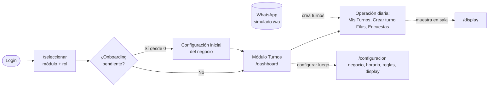

El módulo cubre: **configuración/onboarding del negocio**, **operación de turnos**
(recepción, atención, filas), **encuestas**, **pantalla de sala (display)** y el
**canal de WhatsApp** (hoy simulado).

---

## 1. Arranque y selección de rol (post-login)

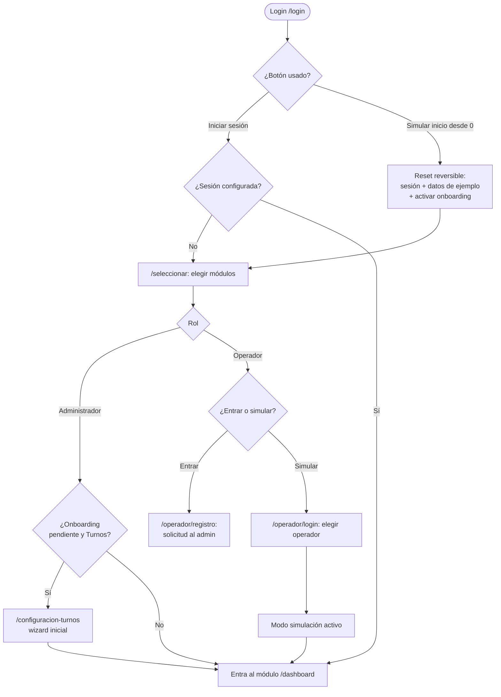

Notas:
- El módulo se elige en `/seleccionar` (Turnos y/o Agendamiento).
- **"Simular inicio desde 0"** (botón en el login) arranca como un negocio recién
  creado: vacía TODOS los datos de ejemplo (filas, operadores, profesionales,
  citas, encuestas) y la config, y activa el onboarding. Es **reversible**: el
  inicio normal ("Iniciar sesión") restaura los datos de ejemplo. Además, en el
  flujo "desde 0" el paso de rol se omite (ya sabemos que somos administradores).
- El **onboarding de configuración** solo se dispara desde "Simular inicio desde 0".
- La **simulación de operador** aplica sus permisos: solo ve las secciones y las
  **filas** que el admin le asignó (ver diagrama 6).

---

## 2. Configuración inicial del negocio (onboarding "desde 0")

Wizard de **7 pasos** (`/configuracion-turnos`) que ve el administrador la primera
vez que crea el módulo:

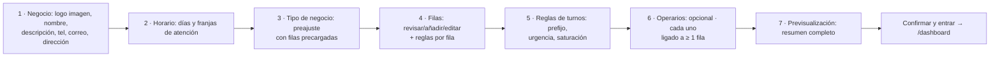

Detalle de cada paso:
1. **Negocio** — logo **subido como imagen** (data URL, hasta 1 MB, con preview),
   nombre (requerido), a qué se dedica, teléfono, correo y dirección.
2. **Horario de atención** — por día de la semana: abierto/cerrado + franja
   (desde/hasta). Se guarda al instante.
3. **Tipo de negocio (preajuste)** — Clínica/Salud, Restaurante, Banco/Trámites,
   Salón/Estética u Otro. Cada tipo **precarga filas sugeridas** (ej. Restaurante →
   En mesa, Para llevar, Domicilio; Clínica → Consulta general, Laboratorio).
4. **Filas** — lista de filas precargadas; se pueden **eliminar**, **agregar** o
   **editar**. Al editar cada fila se definen su modo, tiempo promedio y **reglas
   propias** (prefijo, urgencia, saturación) — ver diagrama 7.
5. **Reglas de turnos** — valores por defecto del negocio (prefijo, reinicio de
   numeración, urgencia, umbrales de saturación).
6. **Operarios** — opcional (se puede omitir). Cada operario se liga a **mínimo
   una fila** (obligatorio); se captura nombre, correo, teléfono y filas.
7. **Previsualización** — resumen amplio (tipo dashboard) de negocio, horario,
   reglas, filas y operarios antes de confirmar.

La configuración se persiste en `localStorage` (`necto.businessConfig`,
`necto.horario`, `necto.turnoRules`, `necto.displayConfig`). Un flag `configurado`
evita repetir el onboarding.

---

## 3. Configuración permanente (botón "Configuración" del sidebar)

La ruta `/configuracion` (dentro del shell) reúne la configuración editable del
negocio en cualquier momento:

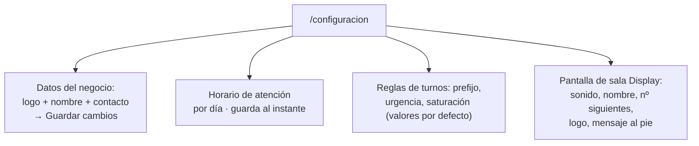

- **Datos del negocio** se confirman con "Guardar cambios" (muestra un aviso de
  éxito). Horario, reglas y display se guardan al instante.
- De momento solo cubre **Turnos**; más adelante reunirá también Agendamiento.

---

## 4. Vistas del módulo Turnos por rol

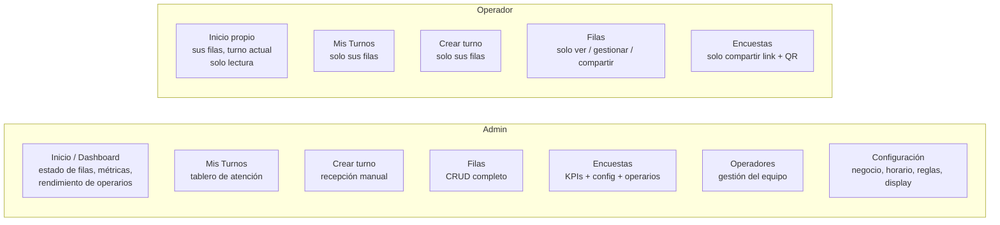

El operador **no** ve: Operadores, Configuración, ni crear/editar/activar/eliminar
filas, ni las estadísticas/configuración de encuestas.

---

## 5. Flujo completo: crear un turno desde WhatsApp

El canal de WhatsApp es **externo** y hoy se **simula** en la vista `/wa` (solo
lectura, 4 conversaciones guionadas cliente ↔ bot). El contexto es una clínica
("Clínica San Rafael") con dos filas: **Consulta general** y **Laboratorio**.

### 5.1 Diagrama general del flujo por WhatsApp

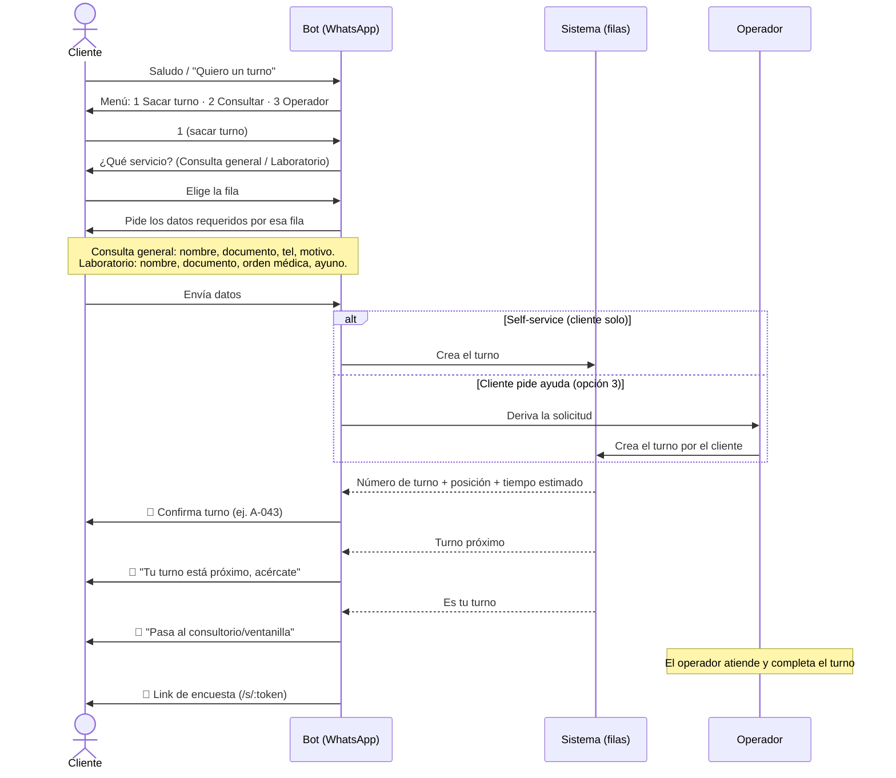

### 5.2 Los 4 escenarios del simulador (`/wa`)

| # | Contacto | Escenario | Fila(s) |
|---|----------|-----------|---------|
| 1 | Ana Silva | Crea su turno desde el celular (self-service) | Consulta general (A-043) |
| 2 | Carlos Mendoza | Pide que le creen el turno (lo crea el operador) | Laboratorio (L-018) |
| 3 | Laura Torres | Crea turno en varias filas | Laboratorio (L-020) + Consulta general (A-044) |
| 4 | Diego Ramírez | Consulta "¿cómo va mi turno?" | Consulta general (A-045) |

---

### 5.3 Chat 1 — Ana Silva · self-service (crea su propio turno)

```text
08:58  Cliente  Buenos días
08:58  Bot      ¡Buenos días! 👋 Bienvenida a Clínica San Rafael. Soy el asistente
                virtual de turnos.
                ¿Qué deseas hacer hoy?
                1️⃣ Sacar un turno
                2️⃣ Consultar mi turno
                3️⃣ Hablar con un operador
08:59  Cliente  1
08:59  Bot      Perfecto. ¿Para qué servicio necesitas el turno?
                1️⃣ Consulta general
                2️⃣ Laboratorio
08:59  Cliente  Consulta general
09:00  Bot      Muy bien 🩺 Para tu turno de *Consulta general* necesito algunos datos.
                ¿Cuál es tu nombre completo?
09:00  Cliente  Ana Silva Rodríguez
09:00  Bot      Gracias, Ana. ¿Cuál es tu número de documento?
09:01  Cliente  1.032.556.778
09:01  Bot      ¿Un número de teléfono de contacto? (por si necesitamos avisarte algo)
09:01  Cliente  300 111 2233
09:02  Bot      Por último, cuéntame brevemente el *motivo de tu consulta* 📝
09:02  Cliente  Tengo dolor de cabeza hace 3 días y algo de fiebre
09:03  Bot      ¡Listo, Ana! 🎫 Registré tu turno:
                • Turno: *A-043*
                • Servicio: Consulta general
                • Documento: 1.032.556.778
                • Motivo: Dolor de cabeza y fiebre
                Hay 3 personas antes que tú. Tiempo estimado: ~15 min.
09:03  Cliente  Perfecto, muchas gracias
09:03  Bot      ¡Con gusto! Te avisaré cuando se acerque tu turno. Puedes quedarte
                en la sala de espera. 🪑
09:15  Bot      🔔 Ana, tu turno *A-043* está próximo. Hay 1 persona antes que tú,
                por favor acércate a la sala de Consulta general.
09:18  Bot      🔔 Es tu turno, Ana. Pasa al *Consultorio 2* de Consulta general. 🙌
09:18  Cliente  Gracias!
09:41  Bot      Esperamos que te sientas mejor pronto 💚 ¿Nos ayudas con una encuesta
                rápida sobre tu experiencia?  [🔗 Responder encuesta → /s/demo]
```

---

### 5.4 Chat 2 — Carlos Mendoza · lo crea el operador

```text
10:05  Cliente  Hola buenas
10:05  Bot      ¡Hola! 👋 Bienvenido a Clínica San Rafael. ¿Qué deseas hacer?
                1️⃣ Sacar un turno
                2️⃣ Consultar mi turno
                3️⃣ Hablar con un operador
10:06  Cliente  Es que soy mayor y no me manejo bien con esto, me pueden ayudar a
                sacar el turno para el laboratorio?
10:06  Bot      No te preocupes, con gusto te ayudamos 🙏 Voy a pasar tu solicitud a
                un operador para que registre tu turno de *Laboratorio*. Dame un momento.
10:06  Bot      Mientras tanto, ¿me confirmas tu nombre completo y tu número de documento?
10:07  Cliente  Carlos Mendoza Ríos, cédula 79.443.221
10:07  Bot      Gracias, don Carlos. ¿Trae orden médica para el examen de laboratorio?
10:08  Cliente  Si, me la dio el médico ayer
10:08  Bot      Perfecto. Un operador está registrando tu turno ahora mismo…
10:10  Bot      ✅ ¡Listo! Un operador registró tu turno:
                • Turno: *L-018*
                • Servicio: Laboratorio
                • Paciente: Carlos Mendoza Ríos
                • Documento: 79.443.221
                Hay 2 personas antes que tú. Tiempo estimado: ~22 min.
10:10  Cliente  Muchísimas gracias, muy amables
10:10  Bot      Con mucho gusto 💚 Recuerda presentar tu orden médica en la ventanilla.
                Te aviso cuando sea tu turno.
10:30  Bot      🔔 Don Carlos, su turno *L-018* está próximo. Acérquese a la
                ventanilla 3 de Laboratorio.
10:33  Bot      🔔 Es su turno. Pase a *Laboratorio, ventanilla 3*. 🙌
10:55  Bot      Gracias por su visita 💚 Nos gustaría saber cómo le fue con la
                atención:  [🔗 Responder encuesta → /s/demo]
```

Este flujo muestra la **derivación a operador** (opción "hablar con un operador"):
el bot recopila datos básicos y un operador registra el turno por el cliente desde
la vista **Crear turno** (`/recepcion`).

---

### 5.5 Chat 3 — Laura Torres · turno en varias filas

```text
11:02  Cliente  Buenas tardes, necesito que el doctor me revise unos resultados pero
                también me toca tomarme unos exámenes nuevos
11:02  Bot      ¡Buenas tardes! 👋 Con gusto te ayudo. Entonces necesitarías dos turnos:
                • *Consulta general* (para revisar resultados)
                • *Laboratorio* (para los exámenes nuevos)
                ¿Los registro ambos?
11:03  Cliente  Si por favor, los dos
11:03  Bot      Perfecto. Empecemos con la *Consulta general*. ¿Tu nombre completo?
11:03  Cliente  Laura Torres Gómez
11:03  Bot      ¿Tu número de documento?
11:04  Cliente  1.098.334.221
11:04  Bot      ¿Y el motivo de la consulta?
11:04  Cliente  Control, revisar resultados de exámenes anteriores
11:05  Bot      🎫 Turno *A-044* en Consulta general registrado. Hay 4 personas antes
                que tú (~20 min).
                Ahora el turno de *Laboratorio*. ¿Tienes la orden médica de los
                exámenes nuevos?
11:05  Cliente  Si, aquí la tengo
11:05  Bot      Perfecto. ¿Vienes en ayunas? Algunos exámenes lo requieren.
11:06  Cliente  Si, no he desayunado
11:06  Bot      🎫 Turno *L-020* en Laboratorio registrado. Hay 1 persona antes que
                tú (~12 min).
                Resumen de tus turnos:
                • *L-020* — Laboratorio (más pronto)
                • *A-044* — Consulta general
                Te recomiendo hacer primero el laboratorio en ayunas y luego pasar
                a consulta. Te aviso de cada uno. 🔔
11:07  Cliente  Excelente, muy organizados. Gracias
11:16  Bot      🔔 Laura, tu turno *L-020* (Laboratorio) está próximo. Acércate a la
                ventanilla 2.
11:45  Bot      🔔 Ahora tu turno *A-044* (Consulta general) está próximo. Pasa a la
                sala de espera del Consultorio 1.
12:20  Bot      ¡Gracias por tu visita, Laura! 💚 Cuéntanos cómo estuvo tu experiencia
                hoy:  [🔗 Responder encuesta → /s/demo]
```

Aquí el bot crea **dos turnos** (uno por fila) y ordena los avisos según el tiempo
estimado de cada fila.

---

### 5.6 Chat 4 — Diego Ramírez · "¿cómo va mi turno?"

```text
09:32  Cliente  Hola, ya saqué un turno hace rato. ¿Cómo va?
09:32  Bot      ¡Hola! 👋 Con gusto reviso el estado de tu turno.
                ¿Me confirmas tu número de documento o el código de tu turno (ej. A-045)?
09:33  Cliente  A-045
09:33  Bot      Un momento, consulto la fila… ⏳
09:33  Bot      📋 Estado de tu turno *A-045* — Consulta general:
                • Estado: *En espera*
                • Posición: hay *2 personas* antes que tú
                • Atendiendo ahora: A-043
                • Tiempo estimado: ~10 min
                Te avisaré cuando estés próximo. 🔔
09:34  Cliente  Perfecto, ¿me da tiempo de ir por un café aquí al lado?
09:34  Bot      Sí, con ~10 min de espera alcanzas 🙂 pero no te alejes mucho: si no
                respondes al llamado, tu turno puede pasar al final de la fila.
09:34  Cliente  Listo, ya vuelvo. Gracias
09:40  Bot      🔔 Diego, actualización de tu turno *A-045*: ahora hay *1 persona*
                antes que tú (~5 min). Ve acercándote a la sala de Consulta general.
09:41  Cliente  Ya estoy aquí
09:41  Bot      ¡Perfecto! 🙌
09:46  Bot      🔔 Es tu turno, Diego. Pasa al *Consultorio 1* de Consulta general.
09:46  Cliente  Gracias!
10:08  Bot      Que tengas una excelente consulta 💚 Al terminar, ¿nos ayudas con una
                encuesta rápida?  [🔗 Responder encuesta → /s/demo]
```

---

## 6. Estados de un turno (tablero "Mis Turnos")

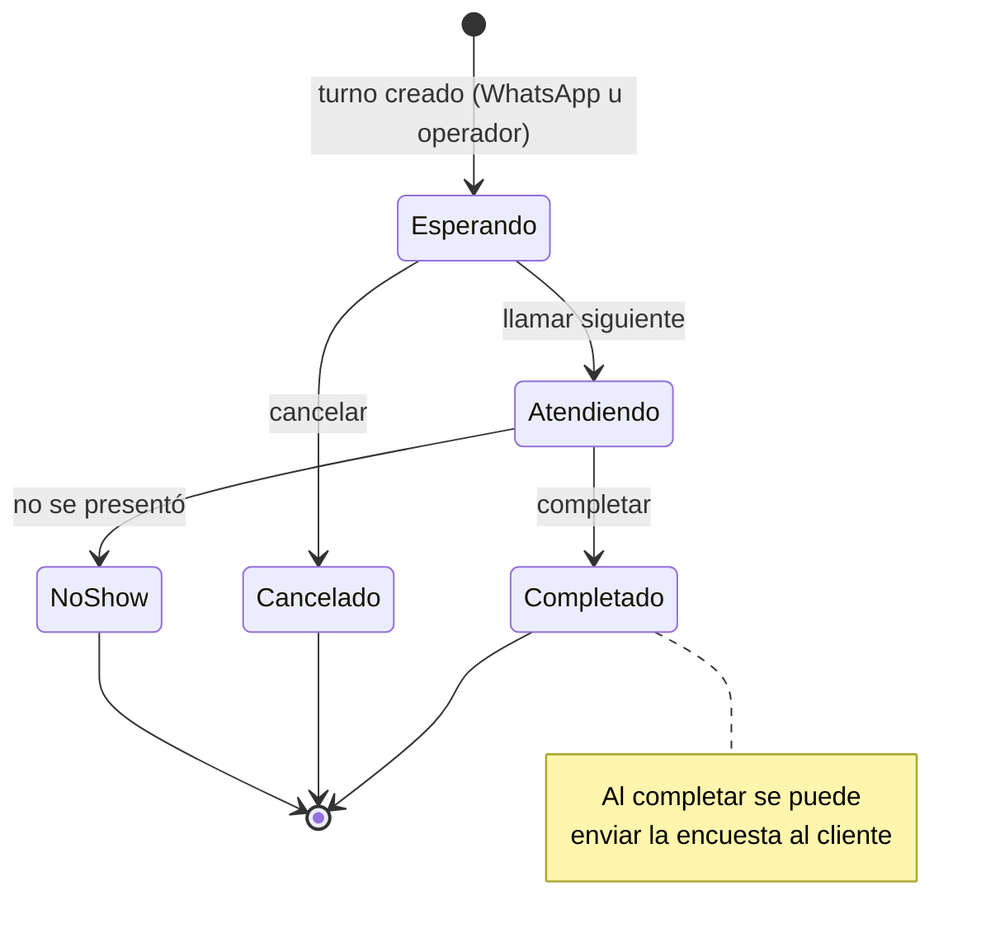

- **Modo auto**: al completar, el sistema llama automáticamente al siguiente.
- **Modo manual**: el operador llama al siguiente cuando decide.
- Solo puede haber **un turno "Atendiendo"** por fila a la vez.
- Un turno es **urgente** cuando su espera supera el umbral (global o por fila).

---

## 7. Reglas de turnos (globales y por fila)

Las reglas controlan cómo se numeran los turnos y cuándo una fila se satura.
Existen **valores globales por defecto** y cada fila puede **sobreescribirlos**.

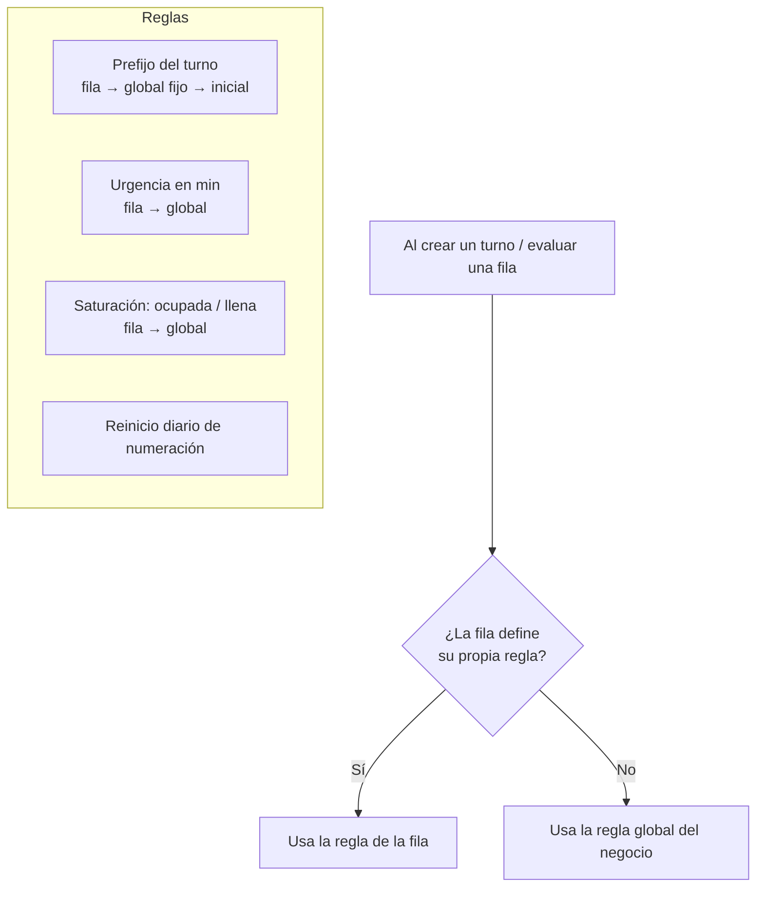

- **Prefijo**: prioridad **prefijo propio de la fila → prefijo fijo global →
  inicial del nombre** (ej. `A-045`, `L-018`, o `LAB-045` si la fila define `LAB`).
- **Urgencia**: minutos de espera desde los que un turno se marca urgente.
- **Saturación**: nº de personas en espera para "ocupada" y "llena" (indicador de
  la fila). "Llena" siempre debe ser mayor que "ocupada".
- Configurable en: la config global (`/configuracion`), el paso 5 del onboarding,
  y por fila al **editar la fila** (en `/colas` o en el paso 4 del onboarding).

---

## 8. Permisos: qué filas ve el operador

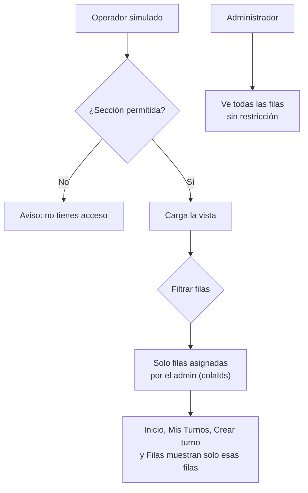

El admin define las filas de cada operador en **Operadores → perfil** (mínimo una).
El filtro aplica en Inicio, Mis Turnos, Crear turno y Filas.

---

## 9. Gestión de filas (solo admin)

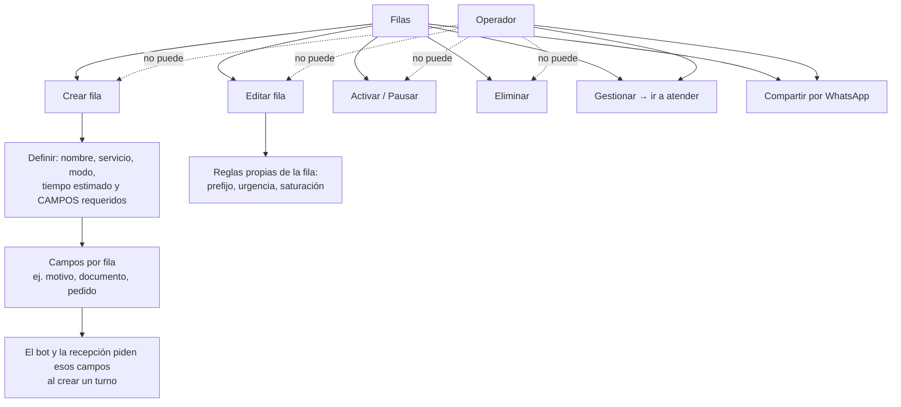

---

## 10. Horario de atención y aviso "fuera de servicio"

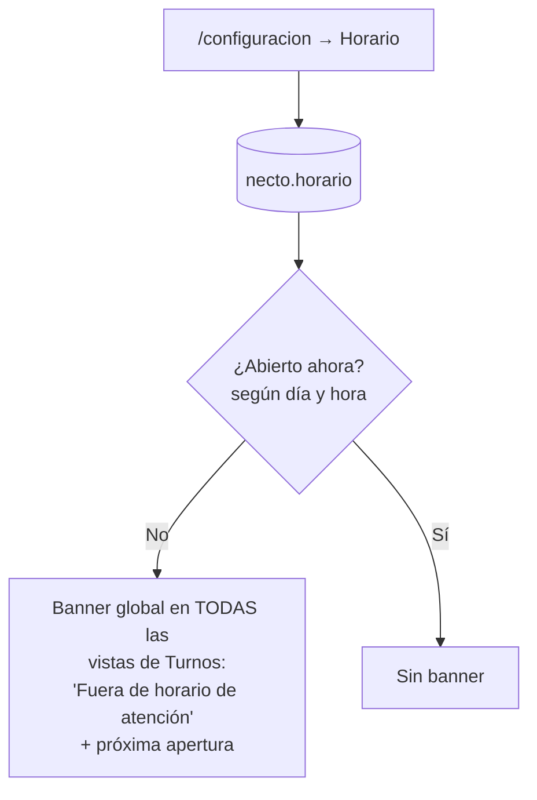

- El horario se define por día (abierto/cerrado + franja).
- Cuando el negocio está **cerrado**, un banner ámbar aparece **en todas las
  vistas de Turnos** (no oculta nada; solo informa) e indica cuándo abre.
- No aplica a Agendamiento.

---

## 11. Pantalla de sala (Display)

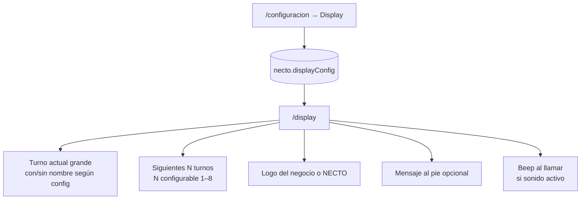

Config del display (en `/configuracion`): **sonido** al llamar, **mostrar nombre**
del cliente (o solo el número), **cuántos siguientes** mostrar, **logo del negocio**
y **mensaje al pie**. El query `?sound=1/0` en `/display` puede forzar el sonido.

---

## 12. Encuesta de satisfacción

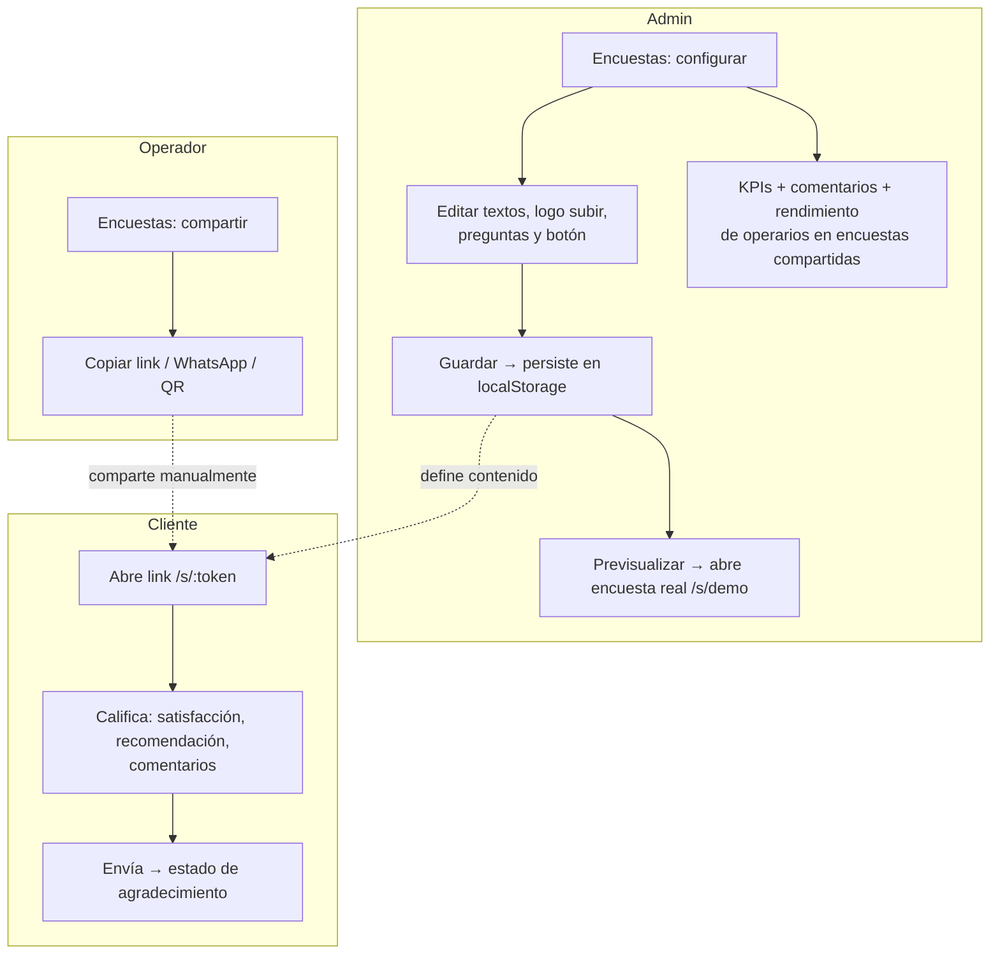

- La encuesta se envía **automáticamente** al terminar el turno (flujo del bot, ver
  el link final de cada chat), y además el operador puede **compartirla manualmente**.
- Solo las encuestas **compartidas manualmente** cuentan en "rendimiento de operarios".

---

## 13. Mapa de rutas del módulo Turnos

| Ruta | Vista | Rol | Notas |
|------|-------|-----|-------|
| `/login` | Login | — | Incluye "Simular inicio desde 0". |
| `/seleccionar` | Selección módulo/rol | — | Standalone. |
| `/configuracion-turnos` | Onboarding inicial | Admin | Wizard de 7 pasos (solo flujo "desde 0"). |
| `/dashboard` | Inicio | Admin / Operador | Admin: panel completo. Operador: inicio propio (solo lectura). |
| `/turnos` | Mis Turnos | Admin / Operador | Tablero de atención; operador solo sus filas. |
| `/recepcion` | Crear turno | Admin / Operador | Recepción manual; operador solo sus filas. |
| `/colas` | Filas | Admin / Operador | Admin CRUD + reglas por fila; operador solo ver/gestionar/compartir. |
| `/encuestas` | Encuestas | Admin / Operador | Admin: dashboard+config. Operador: compartir link+QR. |
| `/turnos/operadores` | Operadores | Solo admin | Gestión del equipo y permisos. |
| `/configuracion` | Configuración | Solo admin | Negocio, horario, reglas, display. |
| `/s/:token` | Encuesta pública | Cliente | Standalone; la abre el cliente. |
| `/wa` | Simulador WhatsApp | Demo | Oculta; 4 conversaciones guionadas. |
| `/display` | Pantalla de sala | — | Standalone; configurable desde `/configuracion`. |

---

## 14. Persistencia (mock, localStorage)

| Clave | Contenido |
|-------|-----------|
| `necto.session` | Módulos y rol seleccionados, operador simulado. |
| `necto.businessConfig` | Datos del negocio + tipo + flag `configurado`. |
| `necto.horario` | Horario de atención por día. |
| `necto.turnoRules` | Reglas globales de turnos (prefijo, urgencia, saturación). |
| `necto.displayConfig` | Config de la pantalla de sala. |
| `necto.surveyConfig` | Config de la encuesta pública. |

Las filas, operadores y datos de agenda viven en memoria (seed) y el modo
"desde 0" los vacía de forma reversible.

---

## 15. Pendientes (fuera del alcance actual, ya conocidos)

- Integración real del bot de WhatsApp (hoy simulado en `/wa`).
- Backend real (turnos, encuestas y config hoy son mock + localStorage).
- Flujo self-service real del cliente (hoy conversaciones guionadas).
- Configuración global que reúna Turnos **y** Agendamiento (hoy solo Turnos).
- HTTPS/CloudFront para el despliegue estático (hoy S3 web en HTTP).
